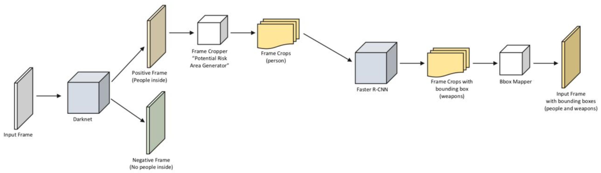

# Real-Time Weapons Detections with YOLO and Faster R-CNN
Final project for the course "Machine Learning and Artificial Intelligence" @Politecnico di Torino. 

* *Main algorithms and techniques:* Faster R-CNN, ResNet-50-FPN, YOLO, Transfer Learning, Data Augmentation.
* *Evaluation metrics:* Accuracy, Precision, Recall, F1-score, IoU, mAP, mAR.
* *Programming language and main libraries:* Python, Pytorch, OpenCV.

### Abstract

In object detection we have to deal with speed/accuracy trade-offs: Faster R-CNN is slower but more accurate, YOLO is much faster but not as accurate especially with small objects. The first model that we consider in this work is Faster R-CNN with Resnet-50 FPN backbone that should ensure good performance in terms of accuracy. We start from a Faster R-CNN pretrained on COCO dataset and finetune the model on the new dataset. Then, we try to improve this method by using YOLO to detect people inside a frame and once found, we feed the Faster R-CNN with the region found in the previous step to further analyze its content. In this way YOLO works as a sort of ‘Potential Risk Areas Generator’ which can help to reduce the computation needed at inference time since a frame with no people inside does not requires to be analyzed by the second model and to further reduce possible false positives as the second net acts only on a reduced area.

 For more details see [*AIML-paper.pdf*](AIML-paper.pdf).

  

<figure>

<figcaption>Final Architecture</figcaption>

</figure>

  

<figure>

<figcaption>Output frames with bounding boxes</figcaption>

</figure>

  
